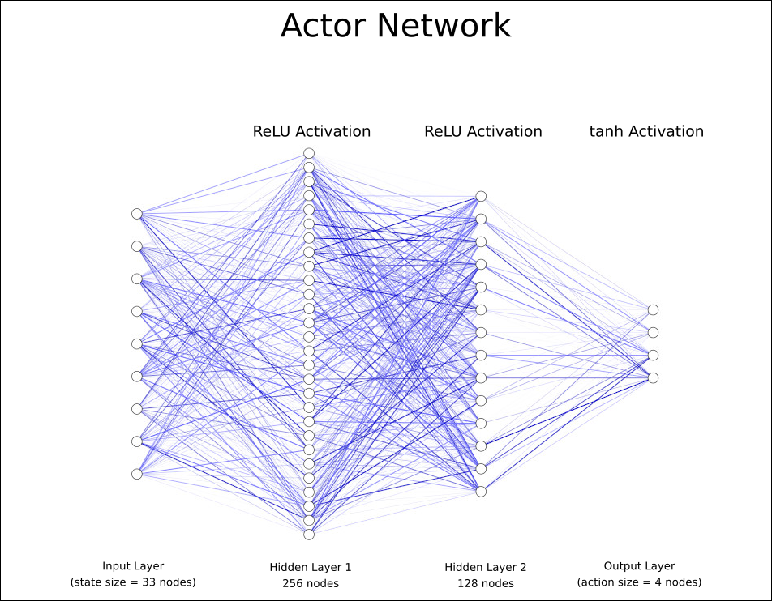
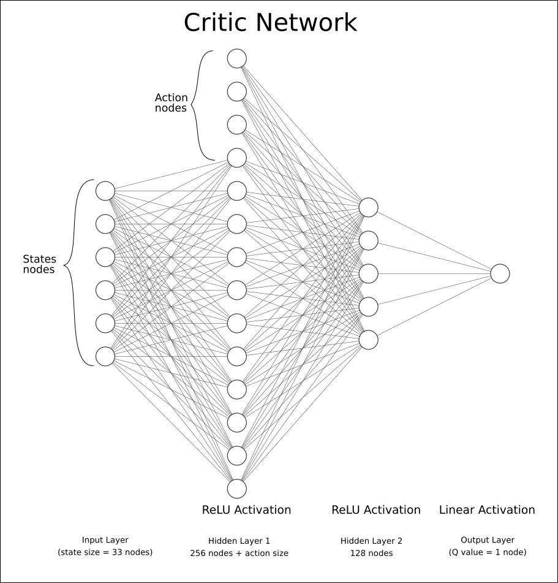
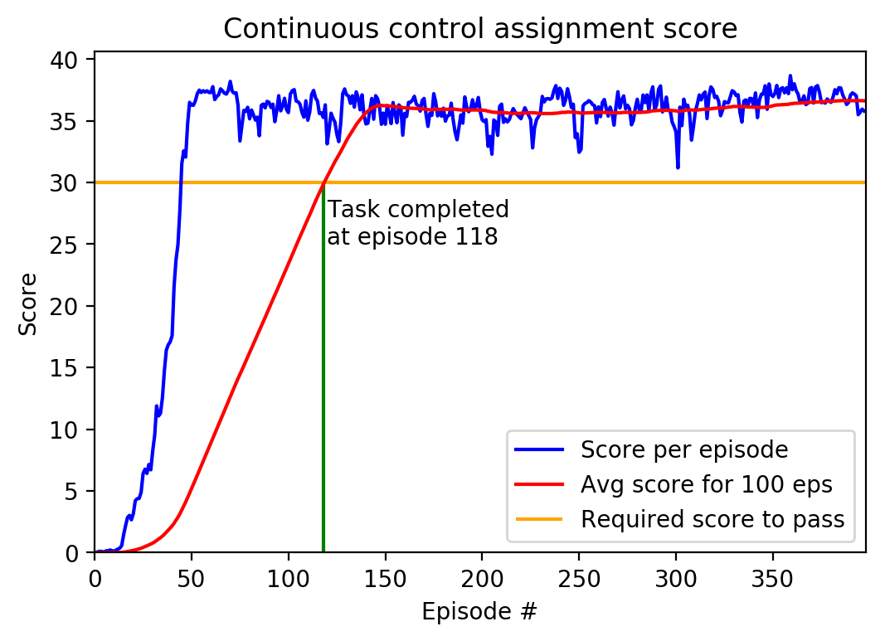

# Report of Assignment
This report explains the method used to solve the Continuous Control Project and the result.

## Learning Algorithm
* This project solved the second version, which is 20 identical agents.
* To solve this reinforcement learning problem, [Deep Deterministic Policy Gradient](https://arxiv.org/pdf/1509.02971.pdf) is used.
* The architectures of _Actor_ is shown in the following figure.

* The architectures of _Critic_ is shown in the following figure.

* Hyperparameters:
  * Batch size: 128
  * Target update rate &tau; = 1 &times; 10-3
  * Discount factor &gamma; = 0.99
  * Learning Rate &alpha; = 5 &times; 10-4
  * Replay Buffer
  * Ornstein-Uhlenbeck noise parameter

## Plof of Rewards
The agent was trained for 704 episodes before reaching 13 average score for 100 consecutive episodes.

## Ideas for future work
  * Applying [D4PG](https://ieeexplore.ieee.org/document/8122622) to further improve the efficiency of the experience replay mechanism in DDPG and thus speeding up the training process. D4PG modify DDPG by introducing prioritize experience replay method. Prioritized sampling is adopted instead of uniform sampling. The experimental results show that DDPG with prioritized experience replay can reduce the training time and improve the stability of the training process, and is less sensitive to the changes of some hyperparameters such as the size of replay buffer, minibatch and the updating rate of the target network.
  
## Credits
  * https://github.com/udacity/deep-reinforcement-learning/tree/master/ddpg-pendulum
  * Distributed Distributional Deterministic Policy Gradients https://ieeexplore.ieee.org/document/8122622

